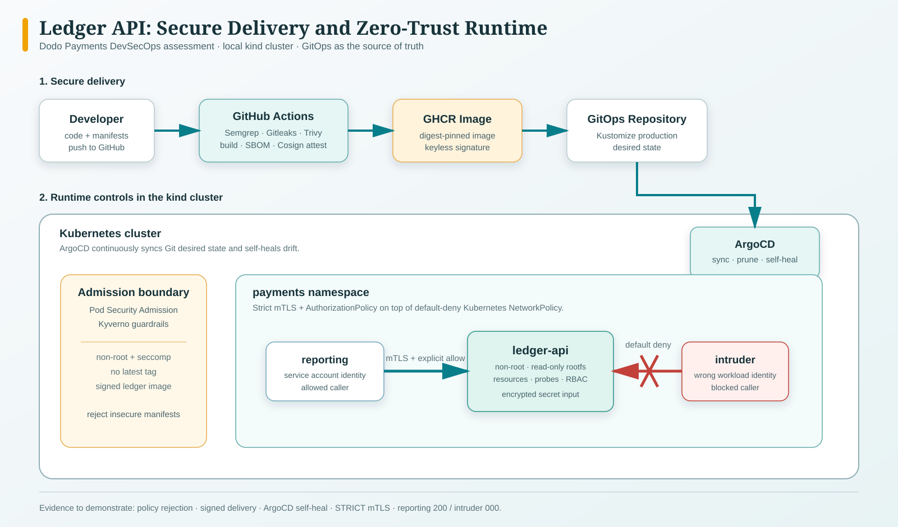

# Dodo Payments DevSecOps Assessment

This is my implementation for the Dodo Payments Security & DevOps Engineer assessment. I started with the supplied `ledger-api` service and focused on making the security controls practical to run and easy to verify locally.

The original insecure manifests remain in [`deploy/`](deploy/) intentionally. They are useful for showing that the admission policies reject an insecure workload rather than merely documenting the intended controls.

## What is included

- A hardened Flask service and minimal production container image
- Kubernetes manifests with RBAC, encrypted secret handling, non-root execution, resource limits, and NetworkPolicies
- Kyverno policies that reject insecure workloads and unsigned images
- GitHub Actions checks for Semgrep, Gitleaks, Trivy, SBOM generation, Cosign signing, and an ArgoCD GitOps handoff
- Istio strict mTLS, service authorization, ingress, and canary routing
- A local, intentionally vulnerable lab and a Task 4 assessment report

## Architecture



## Evidence

Terminal evidence for the local deployment, admission controls, mesh enforcement, and authorised Task 4 tests is indexed in [`docs/evidence/README.md`](docs/evidence/README.md).

<!-- Before sharing the repository, add an unlisted video walkthrough link here. -->

## Repository guide

- [`app/`](app/): hardened application and Dockerfile
- [`k8s/`](k8s/): Kustomize base and production overlay
- [`policies/`](policies/): Kyverno policies
- [`istio/`](istio/): mesh security and traffic-management manifests
- [`gitops/`](gitops/): ArgoCD project and application definitions
- [`.github/workflows/`](.github/workflows/): CI/CD pipeline
- [`docs/`](docs/): implementation notes and verification evidence
- [`task4/`](task4/): isolated vulnerable lab used for the authorised local test

## Run the secure stack locally

The commands below assume the provided kind cluster is named `security-lab`.

```bash
docker build -t ledger-api:secure ./app
kind load docker-image ledger-api:secure --name security-lab
./scripts/deploy-local.sh
```

The deployment script applies the policies and workload manifests. The verification commands and expected results are in [`docs/verification.md`](docs/verification.md).

The sample SOPS secret is deliberately not ready to publish. Before using it outside this machine, create your own age key and re-encrypt it:

```bash
age-keygen -o .age-key.txt
export SOPS_AGE_KEY_FILE=.age-key.txt
sops updatekeys -y k8s/base/secret.enc.yaml
sops --encrypt --in-place k8s/base/secret.enc.yaml
```

## Reproduce Task 4 locally

```bash
./task4/run-local-target.sh
```

This starts the intentionally vulnerable service at `http://127.0.0.1:18080` and a second service that is reachable only from its Docker network. It lets the PAN-disclosure and SSRF findings be reproduced without probing any external Dodo systems. The full scope and findings are in [`docs/task-4.md`](docs/task-4.md) and [`docs/task-4-report.md`](docs/task-4-report.md).

## Assessment notes

- [Task 1: workload and platform hardening](docs/task-1.md)
- [Task 2: secure CI/CD and GitOps](docs/task-2.md)
- [Task 3: zero-trust service communication](docs/task-3.md)
- [Task 4: reconnaissance and local pentest](docs/task-4.md)
- [Local verification record](docs/verification.md)
